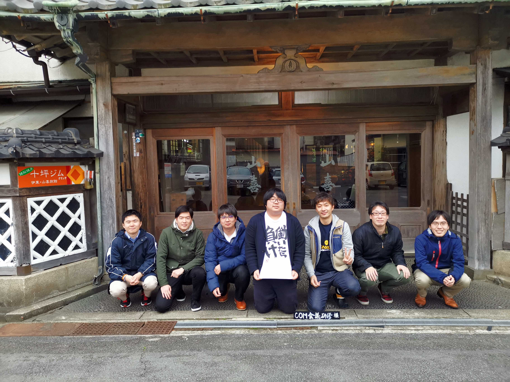

---?image=shima.jpg
@title[toppage]

# 自己紹介

[勝男](https://twitter.com/katu7414)

---
# 所属
- NTTcom ネットワークサービス部　2年目
- UNO VPNチーム
- JANOG 40~ 4回目
- 設計書書いたりconfig書く
- Ansibleで自動化中
- SR,Batfish

---

# 技術領域
- ネットワーク(cisco,VPP,FRR)
- Batfish
- Ansible

---
# 外部発表系

+++

# 大きなイベントでの発表

+++

- JANOG43 LT登壇(https://www.janog.gr.jp/meeting/janog43/program/lt1)
- ネットワークコンテスト略してNETCON 主催者
- https://connpass.com/event/101160/
- https://camp-fire.jp/projects/view/134235

+++

# サポーターズでやった講座

+++

## ネットワークの初学者向け勉強会
- https://supporterzcolab.com/event/653/
- https://supporterzcolab.com/event/459/
- https://supporterzcolab.com/event/417/

---

# 学生時代の時に出ていた大会・実績等

+++

### ICTSC関係
- ICTSC7~8 学生運営委員

自作した問題と解説→http://katu7414.hatenablog.com/entry/2017/09/06/194553

自作した小説→http://katu7414.hatenablog.com/entry/2017/09/22/185728

- ICTSC9優秀賞

参加者として書いたブログ→http://katu7414.hatenablog.com/entry/2018/03/06/175106

+++

# その他
- MBSハッカソン　企業賞受賞

https://www.mbs.jp/hackathon/

- OITLT主催者

http://katu7414.hatenablog.com/entry/2017/10/09/181702

---

# 社内活動

+++

開発合宿

+++

---
# 趣味
- 釣り
- 旅行
- FPS

+++

### 釣りについて(最近行った場所)
- 石垣島
- 伊東

